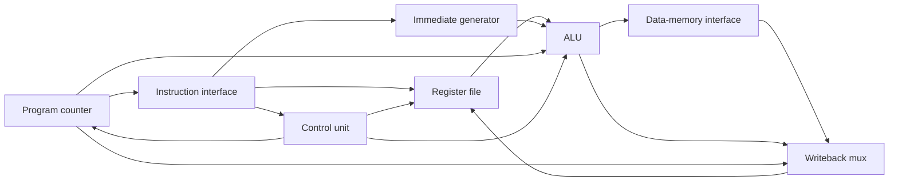

# Educational RV32I-Style Datapath

A compact, synthesizable, single-cycle SystemVerilog datapath built to make the
relationship between instruction decode, register access, execution, memory,
and writeback easy to inspect. The design is intentionally small: it implements
a useful RV32I-style subset without presenting itself as a production processor
or a complete RISC-V implementation.

## Architecture



The five primary RTL blocks are:

1. `rv32i_alu` — arithmetic, logical, comparison, and shift operations.
2. `rv32i_register_file` — 32 registers with asynchronous reads, a synchronous
   write port, and hard-wired `x0` behavior.
3. `rv32i_control_unit` — combinational instruction decode and side-effect
   control, including an explicit illegal-instruction output.
4. `rv32i_pc` — synchronous program-counter state with a parameterized reset
   vector.
5. `rv32i_datapath` — immediate generation, branch decisions, next-PC logic,
   memory interfaces, writeback selection, and integration of the four blocks.

## Supported instruction subset

| Category | Instructions |
| --- | --- |
| Register arithmetic and logic | `ADD`, `SUB`, `SLL`, `SLT`, `SLTU`, `XOR`, `SRL`, `SRA`, `OR`, `AND` |
| Immediate arithmetic and logic | `ADDI`, `SLTI`, `SLTIU`, `XORI`, `ORI`, `ANDI`, `SLLI`, `SRLI`, `SRAI` |
| Upper immediates | `LUI`, `AUIPC` |
| Control flow | `JAL`, `JALR`, `BEQ`, `BNE`, `BLT`, `BGE`, `BLTU`, `BGEU` |
| Memory | `LW`, `SW` |

The decoder suppresses register-file and memory writes for unsupported or
malformed encodings and asserts `illegal_instruction`.

## Top-level interface

`rv32i_datapath` uses simple combinational instruction and data read interfaces.
Writes occur when `data_write_enable` is high at the rising clock edge.

| Signal | Direction | Description |
| --- | --- | --- |
| `clk`, `reset` | Input | Clock and synchronous active-high reset |
| `instruction` | Input | 32-bit instruction at `instruction_address` |
| `instruction_address` | Output | Current program-counter value |
| `data_rdata` | Input | 32-bit load data |
| `data_address` | Output | ALU-generated byte address |
| `data_wdata` | Output | Store data from `rs2` |
| `data_write_enable` | Output | Valid word-store strobe |
| `illegal_instruction` | Output | Unsupported or malformed encoding indicator |
| `debug_writeback_*` | Output | Non-intrusive signals used by testbenches |

## Verification

Every primary block has a self-checking testbench. The decoder test covers every
instruction in the supported subset plus malformed shift, load, store, branch,
and jump encodings. The integration test runs a synthetic program that checks
arithmetic and load writebacks, a store/load round trip, signed branching, a
taken equality branch, skipped-path behavior, and a jump-link writeback. A
mismatch ends the simulation with a nonzero exit status.

Prerequisites:

- GNU Make
- Icarus Verilog 11 or newer (`iverilog` and `vvp`)

Run locally:

```bash
make lint
make test
```

GitHub Actions runs the same lint and test commands on every push and pull
request.

## Repository layout

```text
.
├── rtl/                 # Five synthesizable design blocks
├── tb/                  # Unit and integration testbenches
├── scripts/run_tests.sh # Reproducible Icarus Verilog runner
├── .github/workflows/   # Continuous integration
├── DATA_PROVENANCE.md   # Data and source-origin statement
└── SECURITY.md          # Responsible reporting guidance
```

## Design limitations

- This is an educational, single-cycle implementation, not a production core.
- Only naturally aligned 32-bit loads and stores are implemented.
- There are no exceptions, interrupts, privilege modes, CSRs, fences, atomics,
  compressed instructions, or multiply/divide extension.
- Instruction and data buses do not include ready/valid handshakes or wait
  states.
- Misaligned accesses and control-flow targets are not trapped.
- The design has not been tapeout-qualified, formally verified, or benchmarked
  for frequency, power, or area.

See [DATA_PROVENANCE.md](DATA_PROVENANCE.md) for the repository's sanitization
and source-origin statement.

## License

Released under the [MIT License](LICENSE).
